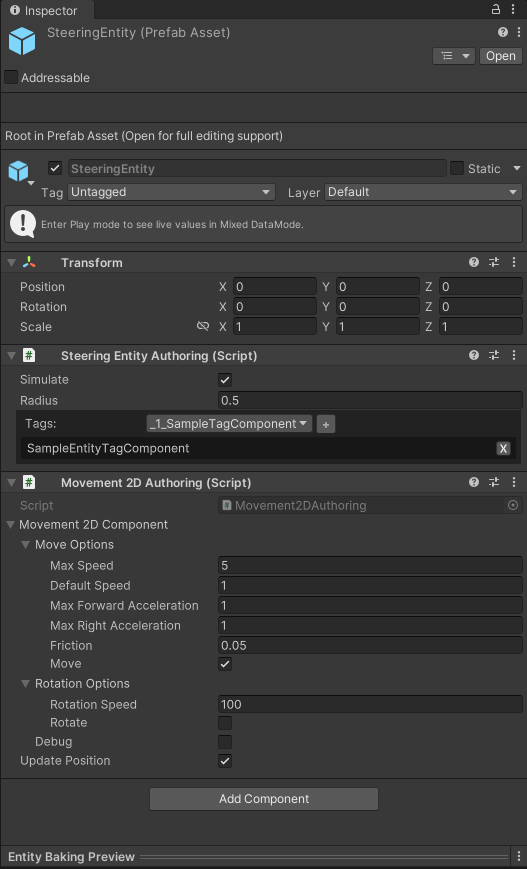
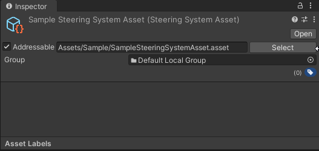
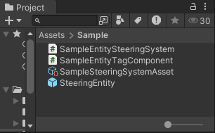
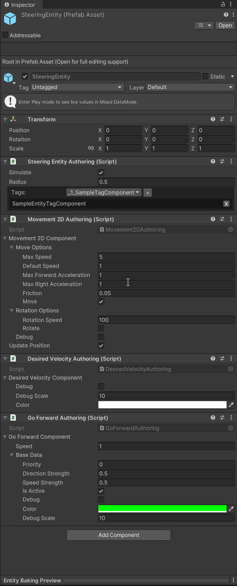

# Minimal Setup

To set up a new system, you need two things.

- **Entity** - An entity controlled by the steering system
- **Steering System** - The system which will control this entity

## Entity Setup 

1. Create a new prefab and add [`SteeringEntityAuthoring`](/docs/documentation-core/base-system/steering-entity) component to it.
2. Optionally, add some mesh as a child to visualize the entity.
3. Add a [`Movement2DAuthoring`](/docs/documentation-defaults/movement/0_2D-movement) component for a [`Movement2DSystem`](/docs/documentation-defaults/movement/0_2D-movement).
4. Create a new tag `SampleEntityTagComponent` for it. This tag tells the steering system which entities belong to it.
5. In [`SteeringEntityAuthoring`](/docs/documentation-core/base-system/steering-entity), select `SampleEntityTagComponent` from the dropdown and add it.

```csharp title="SampleEntityTag.cs"
// highlight-next-line
[SteeringEntityTag] // This will let the editor find this tag. 
public struct SampleEntityTagComponent : IComponentData {}
```

Your prefab should now match the following:



## Steering System Setup

1. Right click into your folder and select `Create/SteeringSystem`. 
2. Rename the newly created asset to `SampleSteeringSystemAsset`, then select it and mark it as addressable. 



3. Create a new C# script which will load and run this system. 

```csharp title="SampleSteeringSystem.cs"
using SteeringAI.Core;
using Unity.Entities;

[UpdateInGroup(typeof(SteeringSystemsGroup))]
public partial class SampleSteeringSystem : BaseSteeringSystem
{
    protected override string getAssetReferenceName()
    {
        return "Assets/Sample/SampleSteeringSystemAsset.asset";
    }
}
```
:::warning
Make sure the path matches addressable address of the system, as shown in image above.
:::

4. Double click the `SampleSteeringSystemAsset` to open it in the [editor window](/docs/documentation-core/editor). 
5. Drag and drop your entity's prefab there. 
6. In the *Main Tag* dropdown, select `SampleEntityTagComponent`.
7. The [editor]((/docs/documentation-core/editor)) lists which components are missing on the entity. Click plus next to [`DesiredVelocityComponent`](/docs/documentation-defaults/Combiner#desiredvelocitycomponent) to add it to the prefab. 
8. Select the *Simple Behaviors* tab and add [`GoForwardJobWrapper`](/docs/documentation-defaults/behaviors/simple-behaviors/go-foward) from the dropdown. This behavior makes entities go in their forward direction.
9. On the right, add [`GoForwardComponent`](/docs/documentation-defaults/behaviors/simple-behaviors/go-foward#goforwardcomponent) to the entity. It is used to parametrize the behavior.


The contents of your folder should now look like this: 



Your prefab should look like this:



## Scene Setup
1. Unity's [ECS](https://docs.unity3d.com/Packages/com.unity.entities@1.3/manual/index.html) requires working with [Subscenes](https://docs.unity3d.com/Packages/com.unity.entities@1.3/manual/conversion-subscenes.html). Right click into the scene hierarchy, select `NewSubscene` and save it.
2. Drag and drop a few of these prefabs into the [Subscene](https://docs.unity3d.com/Packages/com.unity.entities@1.3/manual/conversion-subscenes.html).
3. By changing their `Speed` on [`GoForwardComponent`](/docs/documentation-defaults/behaviors/simple-behaviors/go-foward#goforwardcomponent) you can change how fast they want to travel. 
4. With parameters of [`Movement2DAuthoring`](/docs/documentation-defaults/movement/0_2D-movement), you can change their maximum speed, acceleration etc.
5. Hit play

<video controls width="800">
  <source src="/videos/GoForwardVideo.mp4" type="video/mp4" />
  Your browser does not support the video tag.
</video>

*The video shows a scene with three entities, each with different* `Speed` *on their* [`GoForwardComponent`](/docs/documentation-defaults/behaviors/simple-behaviors/go-foward#goforwardcomponent).