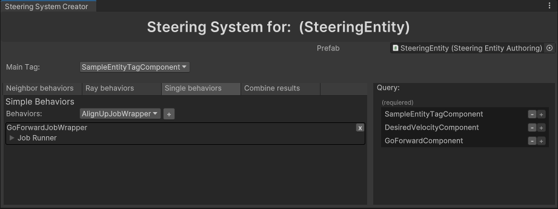

# Minimal Set Up

To set up a new system, you need two things.

- **Entity** - An entity controlled by the steering system
- **Steering System** - The system which will controll this entity

## Entity Set Up 

1. Create a new prefab and add `SteeringEntityAuthoring` [link] component to it.
2. Add a `Movement2DAuthoring` [link] component for a `Movement2DSystem` [link].
3. Create a new tag `SampleEntityTagComponent` for it. This tag tells the steering system which entities belong to it.
4. In `SteeringEntityAuthoring`, select `SampleEntityTagComponent` from the dropdown and add it.

```csharp title="SampleEntityTag.cs"
// highlight-next-line
[SteeringEntityTag] // This will let the editor find this tag. 
public struct SampleEntityTagComponent : IComponentData {}
```

Your prefab should now match the following:


## Steering System Set Up

1. Right click into your folder and select `Create/SteeringSystem`. 
2. Rename the newly created asset to `SampleSteeringSystemAsset`, then select it and mark it as addressable. 


3. Create a new C# script which will load and run this system. 

```csharp title="SampleEntityTagComponent.cs"
using SteeringAI.Core;
using Unity.Entities;

[UpdateInGroup(typeof(SteeringSystemsGroup))]
public partial class SampleSteeringSystem : BaseSteeringSystem
{
    protected override string getAssetReferenceName()
    {
        return "Assets/Sample/SampleSteeringSystemAsset.asset";
    }
}
```
:::warning
Make sure the path matches addressable address of the system, as shown in [img link].
:::

4. Double click the `SampleSteeringSystemAsset` to open it in the editor window [link]. 
5. Drag and drop your entity's prefab there. 
6. In the *Main Tag* dropdown, select `SampleEntityTagComponent`.
7. The editor lists which components are missing on the entity. Click plus next to `DesiredVelocityComponent` to add it to the prefab. 
8. Select the *Single Behaviors* tab and add `GoForwardJobWrapper` from the dropdown. This behavior makes entities go in their forward direction.
9. On the right, add `GoForwardComponent` to the entity. It is used to parametrize the behavior.



The contents of your folder should now look like this: 


Your prefab should look like this:


## Scene set up
1. Drag and drop a few of these prefabs into the scene.

:::note
Dragging and dropping the prefab into a Scene will prompt you to create a new SubScene. Unfortunatelly as of now this is necessary when working with ECS. To learn more about SubScenes and working with entities, refer to the Unity documentation [link].
:::

2. By changing their `Speed` on `GoForwardComponent` you can change how fast they want to travel. 
3. With parameters of `Movement2DAuthoring` [link], you can change their maximum speed, acceleration etc.
4. Hit play

[video]
